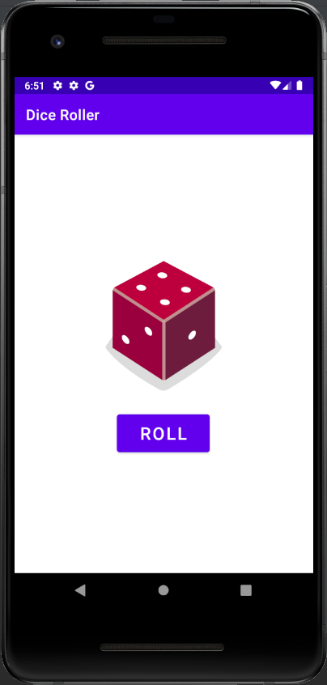
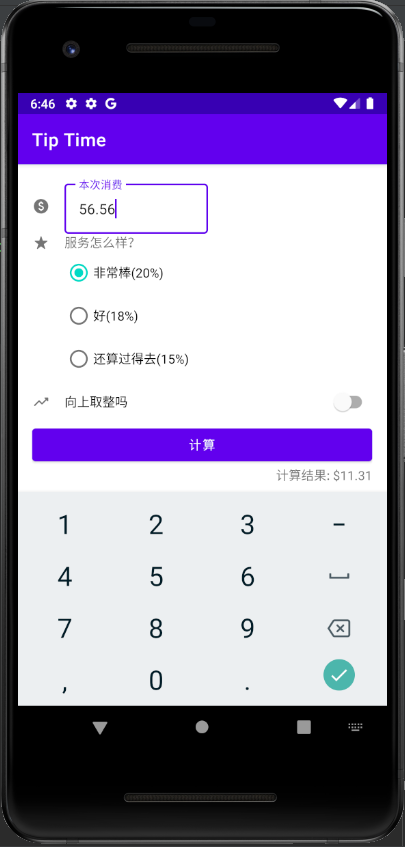

# 课程设计

## 目录

- 第一章 课程设计的目的与要求
  - 1.1 课程设计的目的
  - 1.2 课程设计的要求
- 第二章 课程设计的实验环境
  - 2.1 实验环境
- 第三章 课程设计的内容
  - 3.1 技术介绍
  - 3.2 需求分析
  - 3.3 功能实现
- 第四章 课程设计的总结
  - 4.1 总结

## 第一章 课程设计的目的与要求

### 1.1 课程设计的目的

面向信息时代,几乎每个人都有了自己的移动设备,而这些设备也搭载着不同的操作系统,在操作系统之上,安装着各式各样满足人们不同需求的应用软件,现如今主流的手机操作系统有两个,一个是开放型手机操作系统,以 Android 系统为代表,"Android 手机操作系统于 2020 年期间已占领中国近 88.9%的市场份额...";另一个是闭源型手机操作系统,以 IOS 系统为代表,"已占领中国手机份额 11.1%".

作为软件工程专业的学生,面对市场份额如此之大的 Android 手机操作系统,学会开发 Android 应用或有必要.

### 1.2 课程设计的要求

1. 学习 kotlin 语法
2. 学习构建 Android 应用的基础知识
   2.1 Layouts(布局)
   2.2 Navigation(导航)
   2.3 Connect to the internet(连接到网络)
   2.4 Data persistence(数据持久化)
3. 运用所学知识构建自己的 Android 应用

## 第二章 课程设计的实验环境

### 2.1 实验环境

- 对于 Windows 系统:
  - 64 位 Microsoft Windows 8/10
  - x86_64 CPU 架构;第二代 Intel Core 或更新版本,或支持 Windows Hypervisor 的 AMD CPU
  - 8 GB 内存或更多
  - 最少 8 GB 可用磁盘空间(IDE + Android SDK + Android Emulator)
  - 1280 x 800 最小屏幕分辨率

## 第三章 课程设计的内容

### 3.1 技术介绍

Kotlin 是一种跨平台,静态类型,具有类型推断功能的通用编程语言.Kotlin 旨在与 Java 完全互操作,Kotlin 标准库的 JVM 版本依赖于 Java 类库,但类型推断使其语法更加简洁.

Material Design 是 Google 于 2014 年开发的一种设计语言.在 Google Now 中首次亮相的"卡片"的基础上,Material Design 使用了更多基于网格的布局,响应式动画和过渡,填充以及深度效果(例如光照和阴影).

### 3.2 需求分析

在此次实验中,我们小组准备构建两个 Android 应用,一个叫 Dice Roll:简单的掷骰子应用;另一个叫 Tip Time(小费计算器).

Dice Roll:屏幕中央放置一个按钮,用户点击按钮后,按钮上方的骰子会变成对应的随即点数的图片.

Tip Time:用户输入本次消费的金额,然后选择服务等级,每个服务等级对应不同的消费金额的比例,再选择是否向上取整,最后点击计算按钮,按钮右下方显示计算结果.

### 3.3 功能实现

1. Dice Roll:

> MainActivity.kt(主要逻辑)

```kotlin
import android.os.Bundle
import android.widget.Button
import android.widget.ImageView
import androidx.appcompat.app.AppCompatActivity

class MainActivity : AppCompatActivity() {
    override fun onCreate(savedInstanceState: Bundle?) {
        super.onCreate(savedInstanceState)
        setContentView(R.layout.activity_main)

        val rollButton: Button = findViewById(R.id.button)
        rollButton.setOnClickListener { rollDice() }
    }

    private fun rollDice() {
        val dice = Dice(6)
        val diceRoll = dice.roll()
        val diceImage: ImageView = findViewById(R.id.imageView)
        when(diceRoll)
        {
            1 -> diceImage.setImageResource(R.drawable.dice_1)
            2 -> diceImage.setImageResource(R.drawable.dice_2)
            3 -> diceImage.setImageResource(R.drawable.dice_3)
            4 -> diceImage.setImageResource(R.drawable.dice_4)
            5 -> diceImage.setImageResource(R.drawable.dice_5)
            6 -> diceImage.setImageResource(R.drawable.dice_6)
        }
    }
}

class Dice(private val numSides: Int) {
    fun roll(): Int {
        return (1..numSides).random()
    }
}
```

> activity_main(布局)

```xml
<?xml version="1.0" encoding="utf-8"?>
<androidx.constraintlayout.widget.ConstraintLayout xmlns:android="http://schemas.android.com/apk/res/android"
    xmlns:app="http://schemas.android.com/apk/res-auto"
    xmlns:tools="http://schemas.android.com/tools"
    android:layout_width="match_parent"
    android:layout_height="match_parent"
    tools:context=".MainActivity">
    <Button
        android:id="@+id/button"
        android:layout_width="128dp"
        android:layout_height="64dp"
        android:text="@string/roll"
        android:textSize="24sp"
        app:layout_constraintBottom_toBottomOf="parent"
        app:layout_constraintEnd_toEndOf="parent"
        app:layout_constraintHorizontal_bias="0.498"
        app:layout_constraintStart_toStartOf="parent"
        app:layout_constraintTop_toTopOf="parent"
        app:layout_constraintVertical_bias="0.703" />
    <ImageView
        android:id="@+id/imageView"
        android:layout_width="160dp"
        android:layout_height="200dp"
        android:layout_marginBottom="16dp"
        android:contentDescription="@string/dice_img"
        app:layout_constraintBottom_toTopOf="@+id/button"
        app:layout_constraintEnd_toEndOf="parent"
        app:layout_constraintStart_toStartOf="parent"
        app:srcCompat="@drawable/dice_1" />
</androidx.constraintlayout.widget.ConstraintLayout>
```

应用运行效果:



2. Tip Time:

> MainActivity.kt(主要逻辑)

```kotlin
import android.os.Bundle
import androidx.appcompat.app.AppCompatActivity
import com.example.tiptime.databinding.ActivityMainBinding
import java.text.NumberFormat

class MainActivity : AppCompatActivity() {
 private lateinit var binding: ActivityMainBinding
 override fun onCreate(savedInstanceState: Bundle?) {
   super.onCreate(savedInstanceState)
   binding = ActivityMainBinding.inflate(layoutInflater)
   setContentView(binding.root)
   binding.calculateButton.setOnClickListener { calculateTip() }
 }

 private fun calculateTip() {
   val stringInTextField = binding.costOfServiceEditText.text.toString()
   val cost = stringInTextField.toDoubleOrNull()
   if(cost==null)
   {
     binding.tipResult.text = "输入有误"
     return
   }
   val tipPercentage = when(binding.tipOptions.checkedRadioButtonId) {
     R.id.option_twenty_percent -> 0.20
     R.id.option_eighteen_percent -> 0.18
     else -> 0.15
   }
   var tip = tipPercentage * cost
   if(binding.roundUpSwitch.isChecked) {
     tip = kotlin.math.ceil(tip)
   }
   val formattedTip = NumberFormat.getCurrencyInstance().format(tip)
   binding.tipResult.text = getString(R.string.tip_result,formattedTip)
 }
}
```

> activity_main.xml(布局)

```xml
<?xml version="1.0" encoding="utf-8"?>
<androidx.constraintlayout.widget.ConstraintLayout xmlns:android="http://schemas.android.com/apk/res/android"
    xmlns:app="http://schemas.android.com/apk/res-auto"
    xmlns:tools="http://schemas.android.com/tools"
    android:layout_width="match_parent"
    android:layout_height="match_parent"
    android:padding="16dp"
    tools:context=".MainActivity">
    <ImageView
        android:id="@+id/cost_of_service_icon"
        android:layout_width="wrap_content"
        android:layout_height="wrap_content"
        android:importantForAccessibility="no"
        app:layout_constraintBottom_toBottomOf="@+id/cost_of_service"
        app:layout_constraintStart_toStartOf="parent"
        app:layout_constraintTop_toTopOf="@+id/cost_of_service"
        app:srcCompat="@drawable/round_paid_20" />
    <com.google.android.material.textfield.TextInputLayout
        android:id="@+id/cost_of_service"
        style="@style/Widget.MaterialComponents.TextInputLayout.OutlinedBox"
        android:layout_width="160dp"
        android:layout_height="wrap_content"
        android:layout_marginStart="36dp"
        android:hint="@string/cost_of_service"
        app:layout_constraintStart_toEndOf="@+id/cost_of_service_icon"
        app:layout_constraintStart_toStartOf="parent"
        app:layout_constraintTop_toTopOf="parent">
        <com.google.android.material.textfield.TextInputEditText
            android:id="@+id/cost_of_service_edit_text"
            android:layout_width="match_parent"
            android:layout_height="wrap_content"
            android:inputType="numberDecimal" />
    </com.google.android.material.textfield.TextInputLayout>
    <ImageView
        android:id="@+id/service_question_icon"
        android:layout_width="wrap_content"
        android:layout_height="wrap_content"
        android:importantForAccessibility="no"
        app:layout_constraintStart_toStartOf="parent"
        app:layout_constraintBottom_toBottomOf="@+id/service_question"
        app:layout_constraintTop_toTopOf="@+id/service_question"
        app:srcCompat="@drawable/round_grade_20" />
    <TextView
        android:id="@+id/service_question"
        android:layout_width="wrap_content"
        android:layout_height="wrap_content"
        android:text="@string/service_question"
        android:layout_marginStart="36dp"
        app:layout_constraintStart_toStartOf="@id/service_question_icon"
        app:layout_constraintTop_toBottomOf="@id/cost_of_service" />
    <RadioGroup
        android:id="@+id/tip_options"
        android:layout_width="wrap_content"
        android:layout_height="wrap_content"
        android:checkedButton="@id/option_twenty_percent"
        android:orientation="vertical"
        android:layout_marginStart="36dp"
        app:layout_constraintStart_toStartOf="parent"
        app:layout_constraintTop_toBottomOf="@id/service_question">
        <RadioButton
            android:id="@+id/option_twenty_percent"
            android:layout_width="wrap_content"
            android:layout_height="wrap_content"
            android:text="@string/option_twenty_percent" />
        <RadioButton
            android:id="@+id/option_eighteen_percent"
            android:layout_width="wrap_content"
            android:layout_height="wrap_content"
            android:text="@string/option_eighteen_percent" />
        <RadioButton
            android:id="@+id/option_fifteen_percent"
            android:layout_width="wrap_content"
            android:layout_height="wrap_content"
            android:text="@string/option_fifteen_percent" />
    </RadioGroup>
    <ImageView
        android:id="@+id/round_up_switch_icon"
        android:layout_width="wrap_content"
        android:layout_height="wrap_content"
        android:importantForAccessibility="no"
        app:layout_constraintStart_toStartOf="parent"
        app:layout_constraintBottom_toBottomOf="@+id/round_up_switch"
        app:layout_constraintTop_toTopOf="@+id/round_up_switch"
        app:srcCompat="@drawable/round_trending_up_20" />
    <com.google.android.material.switchmaterial.SwitchMaterial
        android:id="@+id/round_up_switch"
        android:layout_width="0dp"
        android:layout_height="wrap_content"
        android:checked="true"
        android:text="@string/round_up_switch"
        android:layout_marginStart="36dp"
        app:layout_constraintEnd_toEndOf="parent"
        app:layout_constraintStart_toStartOf="parent"
        app:layout_constraintTop_toBottomOf="@id/tip_options" />
    <Button
        android:id="@+id/calculate_button"
        android:layout_width="0dp"
        android:layout_height="wrap_content"
        android:text="@string/calculate_button"
        app:layout_constraintEnd_toEndOf="parent"
        app:layout_constraintStart_toStartOf="parent"
        app:layout_constraintTop_toBottomOf="@id/round_up_switch" />
    <TextView
        android:id="@+id/tip_result"
        android:layout_width="wrap_content"
        android:layout_height="wrap_content"
        android:text="@string/tip_result"
        app:layout_constraintEnd_toEndOf="parent"
        app:layout_constraintTop_toBottomOf="@id/calculate_button"/>
</androidx.constraintlayout.widget.ConstraintLayout>
```

> strings.xml(字符串资源)

```xml
<resources>
    <string name="app_name">Tip Time</string>
    <string name="cost_of_service">本次消费</string>
    <string name="service_question">服务怎么样?</string>
    <string name="tip_options">Tip Options</string>
    <string name="option_twenty_percent">非常棒(20%)</string>
    <string name="option_eighteen_percent">好(18%)</string>
    <string name="option_fifteen_percent">还算过得去(15%)</string>
    <string name="round_up_switch">向上取整吗</string>
    <string name="calculate_button">计算</string>
    <string name="tip_result">计算结果: %s</string>
</resources>
```

应用运行效果:



## 第四章 课程设计的总结

### 总结

Android 应用都是将各种可单独调用的组件加以组合构建而成.例如,activity 是提供界面 (UI) 的一种应用组件.  
main activity 在用户点按您的应用图标时启动.您还可以将用户从其他位置(例如,从通知中,甚至从其他应用中)引导至某个 activity.  
在本次实验中,由于时间有限,所做的应用逻辑都是极其简单的.不过在一周的实验中,掌握了开发 Android 应用的基本流程和方法,收获颇多.
